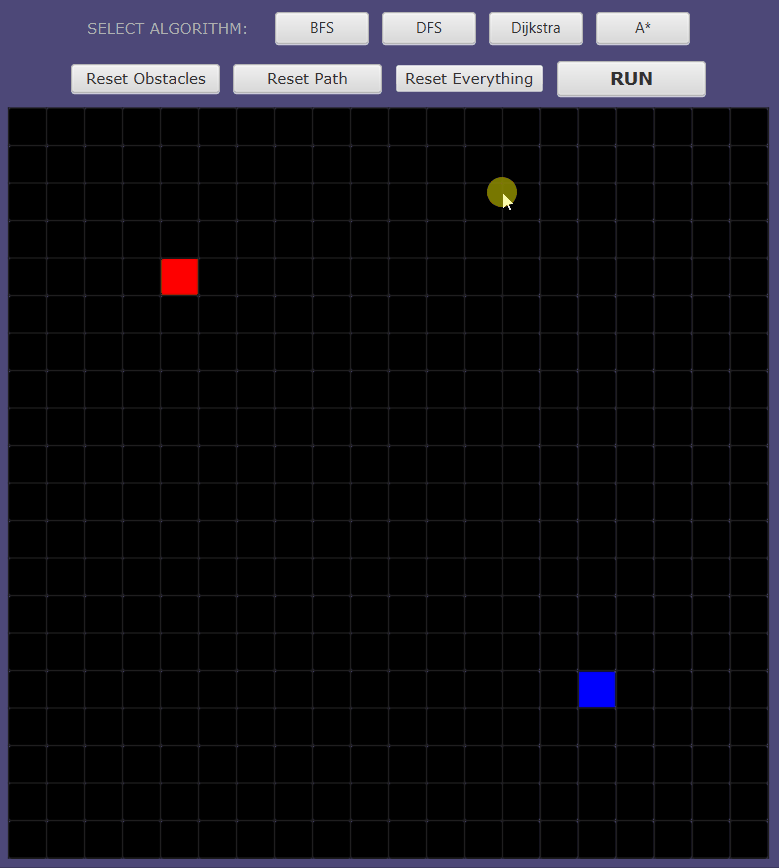
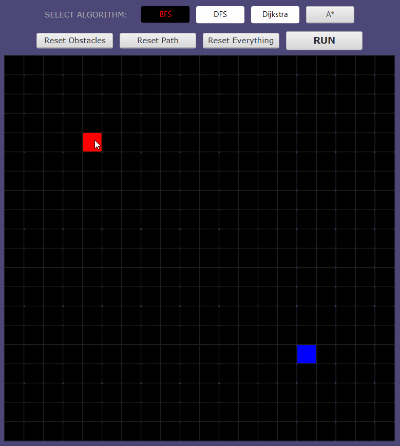
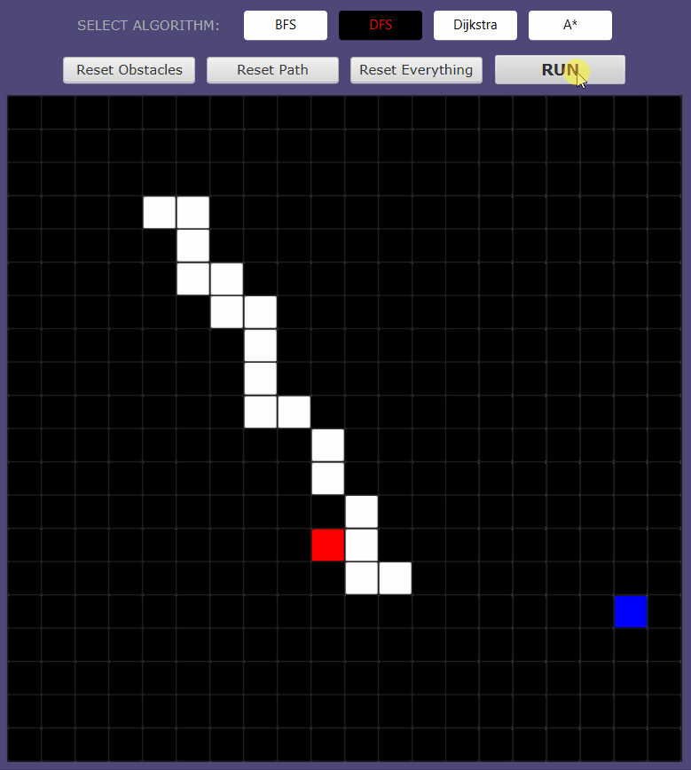
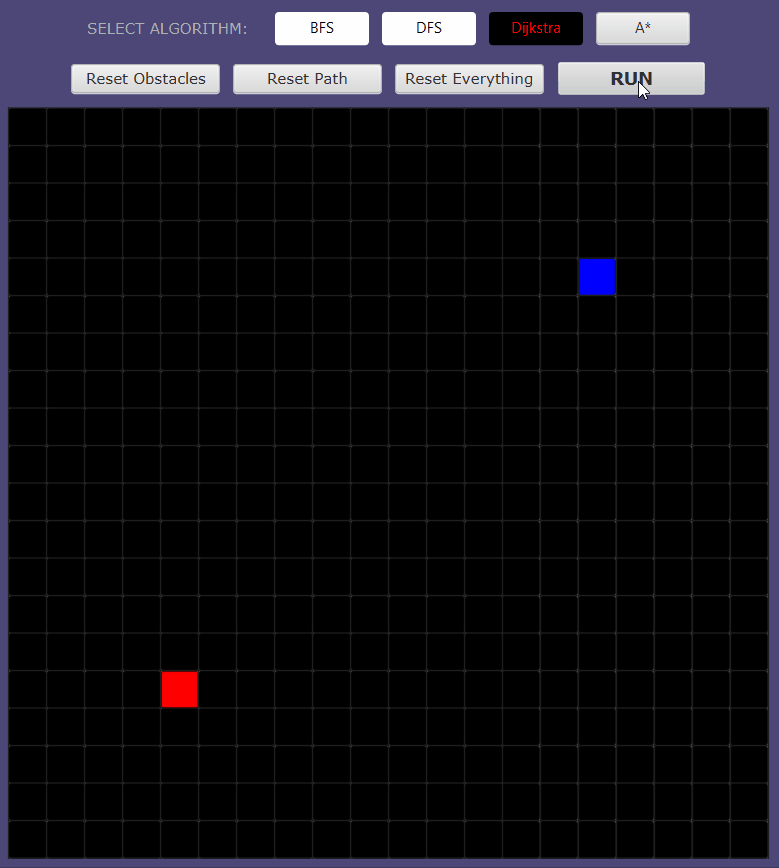
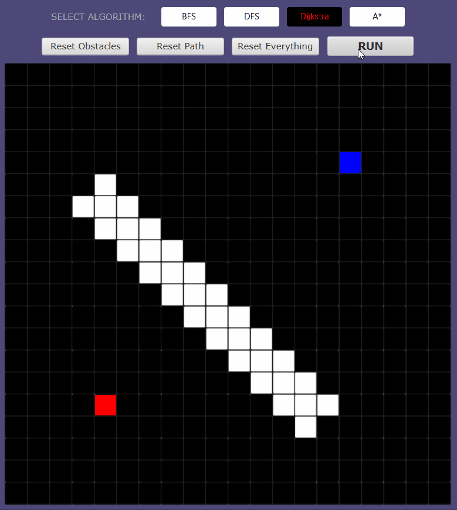
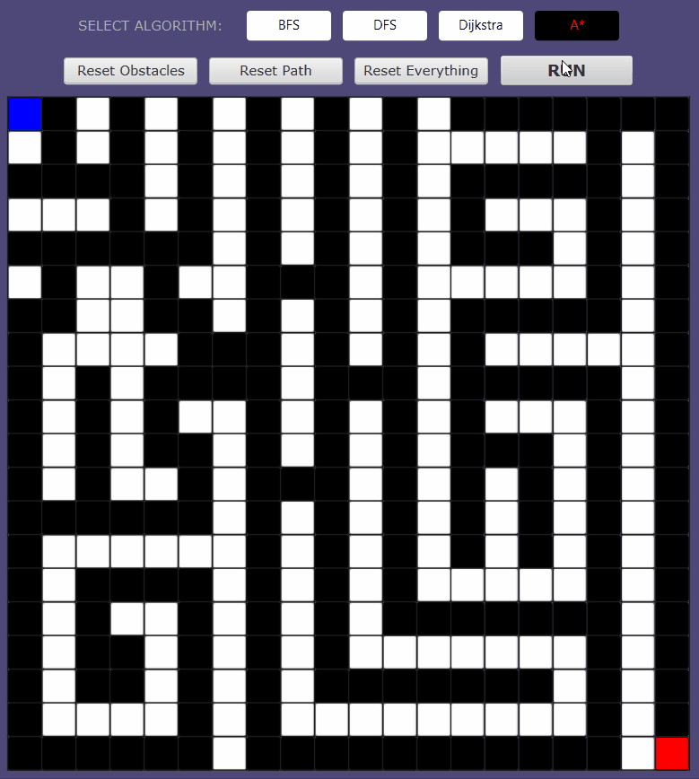

# Pathfinding Visualizer
This application is a GUI that visualizes simple pathfinding/search algorithms: BFS, DFS, Dijkstra, A*. Users are able to move around the start and target nodes, and create obstacles to block paths. It is written in Java and uses the JavaFX 11 platform.
 
 

## Creating Obstacles
Obstacles can be created by clicking and dragging the cursor across the grid.

 

## Moving Nodes
The start and target node can be moved around by clicking them and dragging them around.

 

## Search Algorithms
Users are able to run the BFS (breadth-first search) and DFS (depth-first search) algorithms.

 

## Pathfinding Algorithms
Users are able to run the Dijkstra and A* pathfinding algorithms.

 

## Example of A* in Maze

